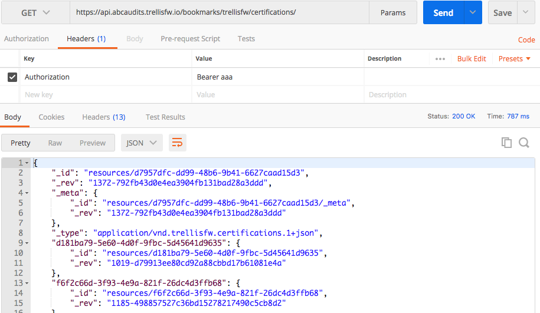
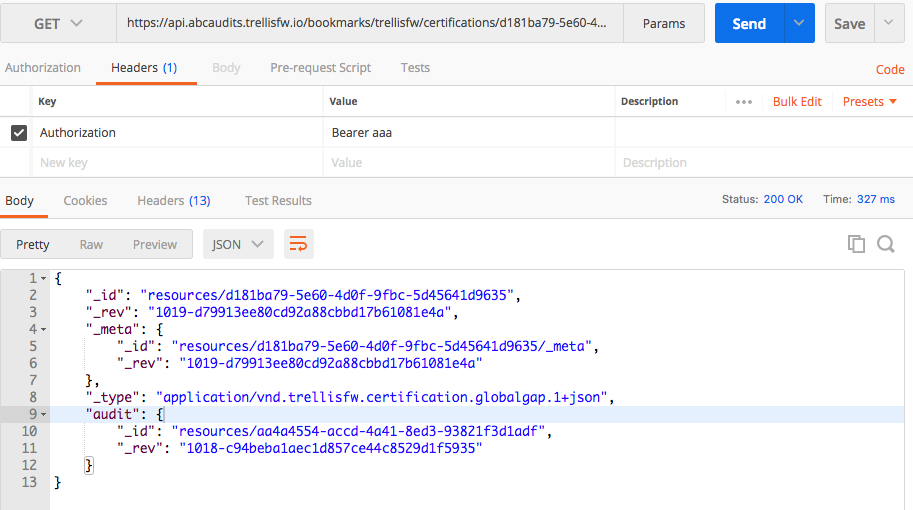
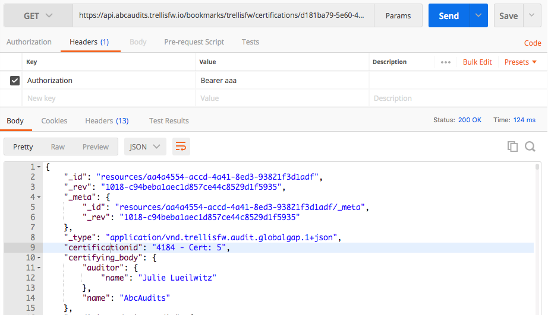

# trellis-docs
Documentation for the Trellis framework for data.

The Trellis Framework builds on the [Open Ag Data Alliance API standards](https://github.com/oada/oada-docs).
The core of this framework is an API spec for creating data **connections** between
platforms. Any platform or app can be made "Trellis conformant" or "OADA conformant" by supporting
that API.  Trellis adds a [document signature process](signatures.md) for document integrity to the OADA 
standard as well.

## Useful links for Trellis:
| Item | Link |
| --- | --- |
|  Data Models   |  https://github.com/OADA/oada-formats/tree/master/formats/application/vnd/trellis |
|  OADA API Core |  https://github.com/OADA/oada-docs |
|  Signatures    |  https://github.com/trellisfw/trellisfw-signatures |
|  Signatures Demo | https://trellisfw.github.io/trellisfw-audit-sign-verify |
|  Proof of Concept Web Apps Code | https://github.com/trellisfw/trellisfw-poc |
|  Live PoC Web Apps | https://trellisfw.github.io/trellisfw-poc/ |
|  OADA Backend supporting PoC | https://github.com/oada/oada-srvc-docker |

## Getting Started

You can start by using the Trellis Proof-of-Concept to create some real data connections and
watch produce safety audits flow between them.  A walkthrough can be found [here](https://trellisfw.github.io/trellisfw-poc/).

The apps are supported by the [OADA reference implementation](https://github.com/oada/oada-srvc-docker).  You
can connect to that API yourself as any of the demo users using [Postman](https://www.getpostman.com/):

```http
GET /bookmarks/trellisfw/certifications HTTP/1.1
Host: https://api.abcaudits.trellisfw.io
Authorization: Bearer aaa
```


You can see the response that came back at the bottom: a JSON document with some keys that are random
strings, and some other keys that start with underscores (_).  The underscore keys are required by the 
OADA API, and the remaining keys are certification id's for food safety certifications.  The way you
know that is by the content type: the content-type identifies a particular kind of document,
the details of which, including examples,  are specified in the 
[OADA Formats](https://github.com/OADA/oada-formats/tree/master/formats/application/vnd/trellis)
repository under "trellis".

OADA defines the concept of a link between documents: each of those certification keys has a 
value that looks like an object with an `_id` and an `_rev` key in it.  That's a "link" to
another resource.  Anything that is a link can be navigated to simply by appending the key of the link 
to the end of the current URL:
```http
GET /bookmarks/trellisfw/certifications/d181ba79-5e60-4d0f-9fbc-5d45641d9635
Host: https://api.abcaudits.trellisfw.io
Authorization: Bearer aaa
```


A "certification" contains an "audit" (as well as potentially corrective actions or a certificate).
Notice the "audit" key looks like one of those link objects again: let's append the "audit" key to the
URL to view the actual audit:

```http
GET /bookmarks/trellisfw/certifications/d181ba79-5e60-4d0f-9fbc-5d45641d9635/audit
Host: https://api.abcaudits.trellisfw.io
Authorization: Bearer aaa
```


## Running your own OADA/Trellis Server:
You can run the OADA reference implementation locally yourself 
(you need docker and docker-compose):

```bash
$ git clone git@github.com:OADA/oada-srvc-docker.git
$ cd oada-srvc-docker
$ docker-compose up -d
```

Once it's up (it takes awhile to build the first time), you can alter your
`/etc/hosts` to map any of the PoC domains to `127.0.0.1` (or alter the docker-compose 
file if you're on Linux instead of Mac).  Or, you can just use localhost directly.
Unfortunately, the included HTTPS certs won't be trusted by Chrome out of the box,
which can cause no end of headaches.  You have to get Chrome to approve it before
Postman will work.  

To do that, just go in Chrome to `https://localhost/.well-known/oada-configuration`.
Then click "Advanced", and "Proceed to localhost (unsafe)".  Now Postman will work
for localhost.  If you mapped any of the other domains, just navigate to their
`oada-configuration` as well.

For further information on the API, please review the [OADA docs](https://github.com/oada/oada-docs).

